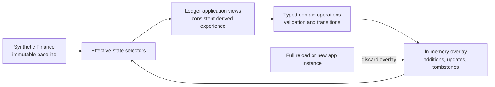

# EDS-001: Ephemeral Demo State

- **Status:** Accepted
- **Scope:** Ledger Bank and future Ledger applications that simulate interactive product experiences
- **Decision owner:** Ledger project architecture

## Purpose

Ledger applications should behave like credible financial products during an active experience without introducing persistence infrastructure that the demonstration does not need. Users may create, update, approve, reject, schedule or remove records and see the consequences consistently until the application fully reloads.

## Decision

Ledger applications use deterministic, immutable synthetic baseline data combined with temporary, in-memory application state to simulate realistic financial operations. User-generated changes remain available throughout the active page lifecycle but are discarded when the application fully reloads.

The architecture has three conceptual layers:

1. **Synthetic Finance: immutable baseline.** `packages/synthetic-finance` supplies canonical businesses, relationships, accounts, balances, transactions, payments, instructions, users, permissions, approval rules and statuses. It remains independent of application mutations. Applications must not modify its original records.
2. **Ephemeral State: temporary mutations.** The application owns an in-memory overlay for additions, replacements, status changes and tombstones created during the current page lifecycle. A deletion normally hides or marks a record in the overlay; it does not remove a canonical synthetic record.
3. **Application experience: derived view.** Screens render effective records derived from baseline plus overlay. A created payment, for example, appears in both payment overview and detail views, with related balances, approval state and messages updated as the domain operation requires.

## Mandatory requirements

### EDS-001.1: Immutable baseline

Synthetic Finance provides deterministic starting records. Application mutations must never alter the canonical dataset. Code that derives effective state must treat baseline objects and collections as read-only even where a library type is structurally mutable.

### EDS-001.2: Temporary mutation

All simulated changes live in memory in the current application instance. Do not use a database, API persistence, `localStorage`, `sessionStorage`, IndexedDB, cookies, service-worker storage or another durable mechanism for these changes.

### EDS-001.3: Consistent experience

Temporary changes must appear across every relevant view and journey and survive supported client-side route navigation in the same application instance. Shared records must not be owned only by one page component. Journeys that require continuity must use Next.js client navigation rather than full-document navigation.

### EDS-001.4: Deterministic reset

A full browser reload restores the Synthetic Finance starting state. A separate tab or new application instance also starts from baseline and owns an independent overlay. Reset must not depend on clearing browser storage.

### EDS-001.5: Domain integrity

Ephemeral operations enforce realistic domain rules: valid entity relationships; currency and integer-minor-unit amount validation; sufficient available balance where applicable; valid lifecycle transitions; permissions and approval rules; duplicate prevention where applicable; and consistent calculated balances and statuses. Ephemeral state changes durability, not business correctness.

### EDS-001.6: Atomic domain transitions

Financial operations involving multiple related records must be validated and applied as a single atomic state transition. An operation must either apply all required state changes or apply none. Validation failure must leave the complete effective state unchanged; intermediate or partially applied financial states must never become observable.

## Architectural boundaries

### Memory is not browser session storage

“Session” in EDS-001 means the lifetime of the current page instance. `sessionStorage` is not compliant because it can survive a refresh. Cross-tab synchronisation is neither required nor desirable; each tab has its own overlay.

### Next.js rendering boundary

Server Components may create or render deterministic baseline data, but they cannot observe mutations held only in a browser-side store. Any view that must react to the overlay must read effective state within the client boundary. Place one provider or store owner above all routes that share the experience—normally in an application layout that persists across client navigation—and initialise it once per mounted application instance.

Keep the baseline serialisable if it crosses the server/client boundary. Do not recreate or replace the overlay during route transitions. Server-rendered baseline content may be used as bootstrap input, but it is not the authoritative source after client mutations begin. A future feature may instead load the deterministic baseline directly in the client bundle if that preserves package boundaries and acceptable bundle cost.

Use `next/link` or the Next.js router for continuity. Full document navigation is a reset boundary by design.

### Synthetic scenarios are not application mutations

Synthetic Finance scenarios are deterministic starting conditions. They may construct independent datasets, but they are not mutable sessions and must not absorb Bank operation logic. `packages/synthetic-finance` continues to own baseline domain contracts, deterministic generation, selectors, calculations and baseline validation; it does not own the ephemeral store.

### Persistence is a separate decision

Persistent state is outside EDS-001. A future application may adopt it only through an explicit architecture decision. No feature may add persistence because a framework or state library makes it convenient.

### Scheduled operations are representations

A scheduled payment may have a realistic status and execution date. EDS-001 does not require a background worker, scheduler or durable queue to execute it later. During the active experience, the instruction and its validation must be represented accurately.

## Ownership and recommended technical shape

| Concern | Owner | Responsibility |
| --- | --- | --- |
| Baseline contracts and records | `packages/synthetic-finance` | Deterministic, independent starting data; pure selectors, calculations and validation |
| Shared state infrastructure | Ledger application | In-memory overlay lifecycle, provider/store boundary, dispatch and reset semantics |
| Finance operations | Ledger Bank finance/domain layer | Typed commands, validation, lifecycle transitions, atomic overlay changes and domain errors |
| Effective-state selectors | Ledger Bank finance/domain layer | Merge baseline and overlay; exclude tombstones; calculate consistent related records and summaries |
| UI and presentation | Ledger Bank application components | Gather input, invoke operations, render effective state and accessible feedback |
| Reusable UI primitives | `packages/design-system` | Presentation and generic interaction only; no banking state or finance operations |

For the current React and Next.js application, start with a narrowly typed React context using `useReducer`, split into state/dispatch access where useful. Keep reducer inputs and finance operations in framework-independent TypeScript modules. Do not add Redux, Zustand or another dependency unless measured complexity—such as subscription performance, debugging needs or multiple independently updated domains—demonstrates that the built-in approach is inadequate.

Prefer an overlay that records only deltas, for example typed additions, replacements/status patches and ID tombstones. Domain operations should validate against the current effective state, then produce one atomic transition. Selectors should accept baseline plus overlay explicitly and return effective records without mutation. IDs and operation timestamps must be deterministic under test: accept an injected ID source and clock rather than reading randomness or the uncontrolled current time inside domain logic.

### Effective-state resolution

Ledger Bank resolves each mutable collection through pure selectors in `apps/bank/src/state/effective-state.ts`. Resolution follows one explicit precedence contract:

1. A tombstone excludes the identifier, regardless of any baseline, created or updated entry.
2. A created record replaces a baseline record with the same identifier; this predictable conflict handling is not permission to create duplicate identifiers.
3. A partial update is shallowly applied to the selected created or baseline record. It cannot change the canonical `id`; nested values such as `roleIds` are replaced as complete fields rather than deep-merged.
4. A baseline record with no applicable delta is returned by reference without copying.

Collections preserve baseline order and positions. Genuinely new records are appended using the overlay’s explicit `createdOrder`; a stable identifier sort is the defensive fallback for a malformed or externally constructed overlay that omits order metadata. Business-specific sorting remains the responsibility of a domain query or presentation adapter, not the fundamental merge operation.

Selectors do not cascade tombstones, validate relationships or manufacture replacements. A surviving approval may therefore retain the identifier of a tombstoned payment, for example. Phase 2B operations must prevent invalid states where the domain requires it; Phase 2A always returns the stored relationship predictably.

Client Components consume these selectors through memoised hooks in `apps/bank/app/useBankEffectiveState.ts`. Each hook depends only on its baseline and overlay collection references, so an unrelated collection delta does not recalculate its result. Existing Server Components continue to render the deterministic baseline through Bank finance adapters. A future interactive view should introduce the smallest client boundary that needs current ephemeral state and must not expect a Server Component to observe the client overlay.

Phase 2A is read-only. It does not define financial commands, validation, lifecycle transitions, multi-record atomic actions, calculated effective summaries or persistence. Those responsibilities remain with Phase 2B and later feature integration.

## Expected behaviour

- Creating a valid payment adds an instruction to effective payment lists and detail lookup, applies the correct initial status and approval requirements, and updates relevant balance measures only when the domain lifecycle says funds are affected.
- Approving or rejecting an instruction updates its approval record and payment status wherever they appear. An invalid transition is rejected without partial state changes.
- A valid transfer creates the related records and updates both affected accounts consistently in the same currency; insufficient funds or incompatible relationships produce a domain error.
- Editing a user changes effective user details across views. Removing a baseline user adds a tombstone or inactive override while leaving the Synthetic Finance record unchanged.
- Client-side navigation preserves all changes. A full reload, a separately opened tab, or a newly mounted application instance begins from the same deterministic baseline.

## Current Ledger Bank assessment

| Classification | Finding |
| --- | --- |
| **Compliant** | `src/finance/environment.ts` creates one deterministic `normal-trading` Caldermere environment, and the finance adapter provides a narrow boundary between Synthetic Finance and product UI. |
| **Compliant** | Synthetic Finance dataset creation deep-clones its anchor; selectors and calculations are read-only; the query context keeps its dataset private and returns cloned results. Existing explicit `asOf` and integer-minor-unit conventions support deterministic domain logic. |
| **Compliant** | Bank navigation uses `next/link`, providing the client-navigation mechanism required for continuity. No Bank application database, API write path, cookie, Web Storage or IndexedDB persistence was found. |
| **Compliant** | The root layout owns a per-application React provider with a normalized delta overlay, tombstones, immutable reducer transitions and reset semantics. Browser verification covers client navigation, reload reset and separate-instance isolation. |
| **Compliant** | Pure effective-state selectors resolve accounts, balances, payments, payment approvals and users without React, browser APIs, storage, clocks or randomness. Memoised client hooks expose them without moving existing routes across the client boundary. |
| **Partially compliant** | Overview and detail routes remain Server Components that read the deterministic baseline directly. This preserves the current read-only experience, but future interactive views must read effective state in focused client descendants rather than expecting Server Components to observe the client overlay. |
| **Not yet implemented** | Typed financial mutation operations, domain validation, lifecycle rules, effective calculated summaries and atomic multi-record actions are deliberately deferred to Phase 2B and later feature work. Their absence is not a current defect. |
| **Not compliant** | None identified in the current implementation. |

The module-level baseline is safe only while treated as immutable. Future infrastructure should make that constraint explicit and should initialise per application instance rather than using a mutable module singleton, which could leak between server requests.

## Phased implementation plan

### Phase 1: Shared ephemeral state infrastructure

- **Scope:** Define overlay and action types, create a per-instance provider/reducer above Bank routes, initialise from a deterministic baseline, and expose read and dispatch hooks. No feature mutations yet.
- **Dependencies:** Agree the overlay granularity, client bootstrap path and provider placement.
- **Acceptance criteria:** One overlay instance survives `next/link` navigation, reload/new instance produces an empty overlay, baseline references are never written, and the design system remains uninvolved.
- **Tests:** Reducer immutability and reset unit tests; provider remount and route-boundary integration tests; static persistence audit.

### Phase 2: Effective-state selectors and typed domain operations

- **Scope:** Add pure merge/select functions, tombstones, typed results/errors, injected clock/ID sources, validation and lifecycle transition functions outside React.
- **Dependencies:** Phase 1 state contract and Synthetic Finance domain types/selectors.
- **Acceptance criteria:** Selectors derive related records consistently; operations validate the current effective state and commit atomic changes; baseline remains deeply equal to its original value.
- **Tests:** Selector and operation unit tests covering relationships, currency, amount, available balance, permissions, approvals, duplicates, transitions and deletions. Use fixed clocks and IDs.

### Phase 3: Payments as the first journey

- **Scope:** Add create/schedule/inspect and, where designed, approve/reject flows to the shared model; migrate payment overview/detail reads to effective selectors.
- **Dependencies:** Phases 1–2 and approved payment lifecycle/approval rules.
- **Acceptance criteria:** A created payment appears in overview and detail; summaries, statuses, approvals, messages and affected balance measures agree; invalid commands make no partial change.
- **Tests:** Domain tests plus component/journey tests for successful and rejected commands and cross-view consistency.

### Phase 4: Navigation and reset validation

- **Scope:** Exercise a complete mutation journey across routes, reloads and independent application instances; guard against accidental persistence.
- **Dependencies:** A working Payments journey and browser test environment.
- **Acceptance criteria:** Client navigation retains mutations; reload and a new tab/app instance restore baseline without storage cleanup; direct full-document navigation has documented reset behaviour.
- **Tests:** Deterministic browser tests for navigation, reload and two isolated contexts; repository scan/assertion for prohibited persistence APIs in the ephemeral-state path.

### Phase 5: Extend by domain

- **Scope:** Add transfers, users, account administration, approval journeys and later Ledger products through domain-specific operations and selectors over the shared infrastructure.
- **Dependencies:** Phase 4 evidence and an approved contract for each domain.
- **Acceptance criteria:** Each feature defines realistic rules, related-record effects, permissions, transitions and reset semantics; shared infrastructure stays domain-neutral; no speculative generic APIs are added.
- **Tests:** Domain contract, integration and journey tests for each increment, including tombstones and calculated-state consistency.

## Compliance verification

Every EDS-001 feature should provide deterministic evidence that:

1. A deep snapshot of the original synthetic baseline is unchanged after successful and rejected operations.
2. Valid mutations appear in effective selectors and every dependent view.
3. State survives client-side navigation through a layout-owned provider that remains mounted.
4. Full reload and provider remount discard changes and reproduce the baseline.
5. Independent browser contexts or application instances start from baseline and do not synchronise overlays.
6. Domain validation rejects invalid relationships, unsafe amounts, currency mismatches, insufficient funds, unauthorised actions, duplicates and invalid transitions as applicable, without partial writes.
7. Tombstoned records are absent from appropriate effective selectors while remaining present in the baseline.
8. No database/API write path, Web Storage, IndexedDB, cookie or other persistence mechanism has entered the feature.

Unit tests should use fixed baseline inputs, clocks and ID generators. Integration tests should mount a fresh provider per case. Browser tests should distinguish `next/link` transitions from `page.reload()` and use isolated contexts for independent instances. Code review should include an explicit persistence search and Server/Client Component boundary check.

## Open implementation decisions

EDS-001 fixes the lifecycle and ownership model, but the first implementation should return for approval with evidence on these details:

- **Provider boundary:** choose the deepest persistent application layout that covers every route sharing mutations without unnecessarily converting unrelated UI to client rendering.
- **Baseline bootstrap:** compare a serialisable server-provided snapshot with client-side deterministic initialisation. The Caldermere environment includes substantial transaction history, so measure RSC payload and client bundle impact before passing the whole dataset through a layout.
- **Overlay shape:** confirm whether per-entity normalized additions/replacements/tombstones or a domain-event representation gives the clearest atomic finance operations. Do not turn this choice into a second canonical dataset.
- **Payments semantics:** approve the exact lifecycle, approval thresholds, balance reservation/booking points, duplicate definition and confirmation-message contract before the Payments phase.
- **Explicit reset control:** a full reload is mandatory reset behaviour; decide separately whether the product also needs a visible “Reset demo” action.

## Guidance for future features

Before implementation, identify the baseline records, domain invariants, overlay deltas, effective selectors, affected views and reset boundary. Keep application state infrastructure generic, finance operations domain-specific, and UI components focused on interaction and presentation. If a feature needs durable data, cross-tab coordination, server-observed mutations or background execution, pause and seek a new architecture decision rather than extending EDS-001 implicitly.
